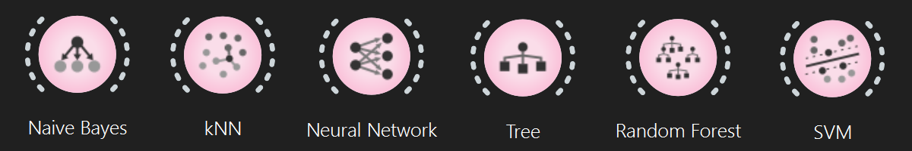

<h1 align="left">🦠 COVID-19 Prediction Based on Patient Health Status</h1>

###

  

###

---

<h2 align="left">📖 Introduction</h2>

###

This university project was developed as part of a Data Mining course.  The project focuses on predicting whether a patient is infected with COVID-19 based on various health and medical attributes using machine learning techniques. It demonstrates the complete data mining workflow, from data preprocessing and feature selection to model training and evaluation.

###

---

<h2 align="left">🔍 Overview</h2>

###

COVID-19 diagnosis can be supported by analyzing patient health indicators and applying predictive machine learning models.  In this project, several classification algorithms were trained and compared to determine which model achieved the highest predictive performance. The project was implemented using Orange Data Mining, which provides a visual environment for data preprocessing, model building, and evaluation.

###

---

<h2 align="left">🎯 Objectives</h2>

###

<b>The main objectives of this university project were:</b> 
  ✅ To preprocess and clean the dataset. 
  ✅ To handle missing values and detect outliers. 
  ✅ To perform feature selection and dimensionality reduction. 
  ✅ To train multiple machine learning models. 
  ✅ To evaluate and compare model performance. 
  ✅ To identify the best-performing model for COVID-19 prediction.

###

---

<h2 align="left">⚙️ Tools & Technologies</h2>

###
  
  - <a href="https://orangedatamining.com" >Orange Data Mining</a> 
  - Machine Learning Algorithms. 

###

---

<h2 align="left">📂 Dataset</h2>

###

- The dataset contains patient health and medical attributes used to predict whether the patient is COVID-19 positive or negative.
- It consists of 5,000 records and 18 columns, providing a solid foundation for training and testing models.
- The dataset was selected from the <a href="https://www.kaggle.com">Kaggle</a> website. 
- Link of Dataset: <a href="https://www.kaggle.com/datasets/miadul/covid-19-patient-symptoms-and-diagnosis-dataset">COVID-19 Dataset</a> 

###

---

<h2 align="left">🔄 Project Workflow</h2>

###

The following Figures illustrate the Workflow setup:

  
   
  <i>Figure: Workflow Setup</i>

<b>The Operations stages:</b> 
1. Dataset Loading and Exploration 
2. Feature Selection 
3. Data Cleaning (Missing Value Handling - Outlier Detection) 
4. Data Transformation and Preprocessing 
5. Dimensionality Reduction 
6. Model Training 
7. Model Evaluation

###

---

<h2 align="left">🤖 Models</h2>

###
<b>The following Figure illustrate classification models were implemented and compared:</b>

  
   
  <i>Figure: Models</i>

- Naïve Bayes
- K-Nearest Neighbors (kNN)
- Neural Network
- Decision Tree
- Random Forest
- Support Vector Machine (SVM)

###

---

<h2 align="left">📊 Model Evaluation</h2>

###

<b>The models were evaluated using:</b>
  
- Test & Score
- Confusion Matrix
- Predictions

Performance metrics included Classification Accuracy (CA), precision, recall, and F1-score.

###

---

<h2 align="left">🏆 Results</h2>

###

The project successfully compared multiple machine learning algorithms and identified the best-performing model for predicting COVID-19 infection.

The results demonstrated the importance of proper preprocessing and feature engineering in improving predictive accuracy.

###

---

<h2 align="left">📚 Key Learnings</h2>

###

<b>Through this project, I gained practical experience in:</b>
  
- Data cleaning and preprocessing
- Feature selection
- Model training and evaluation
- Comparing machine learning algorithms
- Using <a href="https://orangedatamining.com">Orange</a> for end-to-end data mining workflows

###

---

<h2 align="left">⚖️ Legal & Ethical Disclaimer</h2>

###

  
  - This project was developed as part of a university course on Data Mining.  
  - ⚠️ This is an academic project for educational and research purpose only, it's NOT a medical diagnostic tool.  
  - ⚠️ The author assumes no responsibility for medical use without prior physician approval.  
  - ⚠️ The author disclaims any liability for health risks, legal issues, or unauthorized use.  

###

---

<h2 align="left">🎓 Academic Context</h2>

###

This project was developed as part of a university course on Data Mining in 2026.

###

---

<h2 align="left">📄 License</h2>

###

This project is licensed under the [MIT License](LICENSE). You are free to use, modify, and distribute this software.

###
